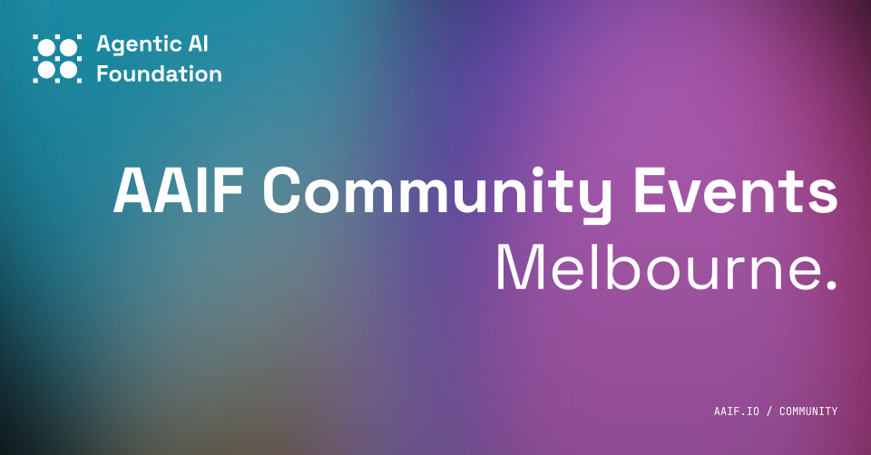

  
Agentic AI Melbourne · October 2026

  <h1 style="padding-top: 4rem">G'Day</h1>
  

    1 October 2026
    BlueRock · Melbourne
  

  

<!--
G'day everyone, and welcome to Agentic AI Melbourne.

I'm Gajan Kugamoorthy, one of the AAIF community event organisers here in Melbourne, and I'll be your MC tonight.

Thank you for making the time to be here.

Before we get into the talks, I want to give a little context about this community, why we've brought this room together, and how we hope tonight will work.

First, I just want to call out that our aim for this event is progress over perfection. This is a new community and, and we're hoping to learn from tonight. 

So if you have feedback after tonight, please let us know. And of course, we'll be asking for it!
-->

---

# What is the AAIF?

The Agentic AI Foundation is the Linux Foundation’s neutral home for open standards and projects that power AI agents.

  

    
  

  

    

      
Cloud native ecosystem

      

        
      

      
↓

      

        

          
        

        

          
        

        

          
        

        

          
        

      

    

    

      
Agentic AI ecosystem

      

        
      

      
↓

      

        

          
        

        

          
          <strong>AGENTS.md</strong>
        

        

          
          <strong>goose</strong>
        

        

          
          <strong>agentgateway</strong>
        

      

    

  

<!--
You've probably seen the AAIF name everywhere around this event, and because it's relatively new, there's a chance you might not have heard of it before or don't know anythign about it.

The AAIF is the Agentic AI Foundation. It is a non-profit, vendor-neutral foundation under the Linux Foundation.

This diagram shows the relationship relative to a more well known sibling, the CNCF. The Linux Foundation provides the umbrella and neutral governance. The CNCF is home to projects including Kubernetes, Cilium, Flux, and Fluent Bit. In a similar way, the AAIF is home to MCP, AGENTS.md, goose, and agentgateway.

For those not familiar, the CNCF became a neutral home for important cloud-native projects and helped an ecosystem form around Kubernetes. It's my understand that the AAIF aims to play a similar role for agentic AI: stewarding shared standards and open source infrastructure so the ecosystem can develop in the open.
-->

---

# Who is in the room?

  

    
01

    <strong>Engineers</strong>
    
Software experience, demonstrated use of AI agents, and a habit of building things.

  

  

    
02

    <strong>Builders</strong>
    
Different background, exceptional use of AI agents, and something real to show for it.

  

Our goal for tonight: <strong>Bring people together who are building with AI agents.</strong>

<!--
As you all know, this event required registration which needed approval.

Every registration was hand reviewed, because this event is deliberately for engineers and builders.

Roughly, our entry requirements were one of two things.

First: engineers — people with a history of work as a developer or software engineer, who also demonstrate that they're using AI agents and building things.

Or second: builders — people who might not have that traditional work history, but who demonstrate exceptional use of AI agents to build something.

The common thread is merit. We want people in this room primarily because of what they're building, learning, and contributing — not their title, their employer, or the size of their following.
-->

---

# What do expect of you?

  

    
01<strong>Kindness</strong>

    

      
<strong>Introduce yourself</strong>Start with hello.

      
<strong>Be friendly</strong>Assume good intent.

      
<strong>Welcome others</strong>Make room in the conversation.

    

  

  

    
02<strong>Curiosity</strong>

    

      
<strong>Ask questions</strong>Explore ideas together.

      
<strong>Share</strong>Offer what you know.

      
<strong>Learn</strong>Stay open to new answers.

    

  

<!--
Now, there are two things we'd like to see from everyone here tonight: kindness and curiosity.

Kindness means introducing yourself to somebody you don't know, being friendly, and actively welcoming other people into the conversation.

Curiosity means asking questions in good faith, sharing what you know, and being ready to learn from the experience around you.

There is a huge range of experience in this room, and the field itself is moving incredibly quickly. None of us have all the answers.

So please learn generously and share generously. The conversations before, between, and after the talks are as important as what happens on stage.
-->

---

# Say hi to our event team

  

    
    

      <strong>Chris Rickard</strong>
      <a href="https://www.linkedin.com/in/chrickard/" target="_blank"><carbon-logo-linkedin />@chrickard</a>
    

  

  

    
    

      <strong>Gajan Kugamoorthy</strong>
      <a href="https://www.linkedin.com/in/kgajananan/" target="_blank"><carbon-logo-linkedin />@kgajananan</a>
    

  

  

    
    

      <strong>Iman Yusuf</strong>
      <a href="https://www.linkedin.com/in/imanyusuf/" target="_blank"><carbon-logo-linkedin />@imanyusuf</a>
    

  

  

    
    

      <strong>Phil Nash</strong>
      <a href="https://www.linkedin.com/in/philnash/" target="_blank"><carbon-logo-linkedin />@philnash</a>
    

  

  

    
    

      <strong>Prem Pillai</strong>
      <a href="https://www.linkedin.com/in/cloud-on-prem/" target="_blank"><carbon-logo-linkedin />@cloud-on-prem</a>
    

  

  

    
    

      <strong>Rob Kenefeck</strong>
      <a href="https://www.linkedin.com/in/robkenefeck/" target="_blank"><carbon-logo-linkedin />@robkenefeck</a>
    

  

  

    
    

      <strong>Ryan Djurovich</strong>
      <a href="https://www.linkedin.com/in/ryandjurovich/" target="_blank"><carbon-logo-linkedin />@ryandjurovich</a>
    

  

  

    
    

      <strong>Dr Sam Donegan</strong>
      <a href="https://www.linkedin.com/in/samueldonegan/" target="_blank"><carbon-logo-linkedin />@samueldonegan</a>
    

  

  

    
    

      <strong>Yann Vigara</strong>
      <a href="https://www.linkedin.com/in/yvigara/" target="_blank"><carbon-logo-linkedin />@yvigara</a>
    

  

<!--
A quick introduction to the people who've signed up to be community organisers for this event.

They are Chris Rickard, Gajan Kugamoorthy, Iman Yusuf, Phil Nash, Prem Pillai, Rob Kenefeck, Ryan Djurovich, Dr Sam Donegan, and Yann Vigara.

Events like this take a surprising amount of work behind the scenes. Please say hello to us, and please tell us what would make the next one better.
-->

---

# Thank you to our sponsors

  

    Venue
    

      

      

    

  

  

    Food & drinks
    

      

      

      

    

  

<!--
Tonight would not be possible without the support of our sponsors.

Thank you to BlueRock and AI Dojo for providing tonight's venue.

And thank you to OpenAI, Optimising.com.au, and Union.ai for providing the food and drinks.

Their support gives this community a place to meet, learn, and share what we're building.

One ask for everyone: please be respectful of the venue and clean up after yourselves before you leave.
-->

---
class: blank-slide
---

<!--
BLUEROCK SLIDE HERE

TODO: Replace this blank placeholder with BlueRock's supplied slide.
-->

---

# Tonight's line-up

  

    
    Main Talk<strong>How to Build Your Own AI Agent with goose</strong>Lifei Zhou · Software Engineer, Block
  

  

    
    Lightning Talk<strong>So You Want to Ship an MCP Server?</strong>Jeffrey Aven · Founder, StackQL
  

  

    
    Lightning Talk<strong>The 1000x Junior Developer</strong>Zach Jensz · Software Engineer, Method Recruitment Group
  

  

    
    Lightning Talk<strong>Are we at AGI yet?</strong>Chris Rickard · Founder, Userdoc
  

Doors 5:30<i></i>Talks from 6:00<i></i>Social 8:00–8:30

<!--
Here's our line-up for tonight.

The format we're looking at running with these events is to have one main talk, followed by three lightning talks.

Lifei will show us how to build our own AI agent with goose.

Then Jeffrey will share what it takes to ship an MCP server.

Zach will introduce the thousand-times junior developer.

And Chris will ask: are we at AGI yet?

The goal is to finish here between 8 and 8:30, then head to our after-event community social.
-->

---
class: blank-slide
---

<!--
INTENTIONAL SECTION BREAK.

Leave this slide displayed during the talk programme if a neutral screen is needed.

The following slides are the outro section.
-->

---

# Thank you to our speakers

  
<strong>Lifei Zhou</strong>Block

  
<strong>Jeffrey Aven</strong>StackQL

  
<strong>Zach Jensz</strong>Method Recruitment Group

  
<strong>Chris Rickard</strong>Userdoc

One more round of applause.

<!--
What a fantastic set of talks.

Please join me in thanking Lifei, Jeffrey, Zach, and Chris — for the preparation, the candour, and the ideas they shared with us tonight.

Speaking takes work. Sharing unfinished lessons and real failures takes courage. The quality of this community depends on people being willing to do both.

Let's give all four speakers one more round of applause.
-->

---

# How did we do?

  

    
Help us make the next event better.

    
Just 5 short questions. It should take one minute.

    <a href="https://docs.google.com/forms/d/e/1FAIpQLSfSjSNhv-9zEwy3k4kmUU8PQwwC7LGt0Rt8depY7knPOWvGwg/viewform?usp=publish-editor">Open the feedback form →</a>
  

  <ProjectQr value="https://docs.google.com/forms/d/e/1FAIpQLSfSjSNhv-9zEwy3k4kmUU8PQwwC7LGt0Rt8depY7knPOWvGwg/viewform?usp=publish-editor" :size="260" />

<!--
Before we wrap up, we'd really value your feedback on tonight's event.

It's just five short questions and should take one minute. Please scan the QR code and let us know what worked and what we could make better next time.
-->

---

# What are you building?

  

    
Speak at our next event.

    
Practical lessons. Honest failures. Things that other builders can use.

    <a href="https://forms.gle/yeyvhsizE1f6oqAX8">forms.gle/yeyvhsizE1f6oqAX8</a>
  

  <ProjectQr value="https://forms.gle/yeyvhsizE1f6oqAX8" :size="260" />

<!--
With that said, we're a new event and we're looking to build our list of potential speakers.

If you're building something interesting, learning something the hard way, or have a practical technique others can use, we'd love to hear from you.

You do not need a polished keynote. In fact, practical lessons and honest failures are exactly what we want. And with what James has just shown you, hopefully you'll be able to whip-up some slides, should you need them, in just a few minutes!

So please scan the QR code to submit to our call for papers. If you're unsure whether an idea is ready, come and talk to us tonight.
-->

---

# Next month

  

    
Save the date.

    
Thursday 5 November 2026

    
Registrations opening soon.

    <a style="font-size: 1.1em;" href="https://luma.com/7qtmasup">luma.com/7qtmasup</a>
    
Follow the Melbourne community Luma page to be notified of all future events.

    <a style="font-size: 1em;" href="https://aimelb.org">aimelb.org</a>
  

  <ProjectQr value="https://luma.com/7qtmasup" :size="260" />

<!--
Our next Agentic AI Melbourne event will be on Thursday, the fifth of November.

The event page is live, but registrations are not open yet.

Scan this QR code to open the event page, and follow the Melbourne community Luma page to be notified when registrations open.
-->

---
class: devfest-promo-slide
---

<!--
Reference presentation:
https://docs.google.com/presentation/d/1DvzC3XiURw7GyX3yE77JE6AeSP1bQEhdCHT2iAstLvc/edit?usp=sharing
-->

---

# Thank you to our sponsors

  

    Venue
    

      

      

    

  

  

    Food & drinks
    

      

      

      

    

  

Space to meet. Support to learn. A community brought together.

<!--
Before we wrap up, one more thank you to our sponsors.

Thank you to BlueRock and AI Dojo for the venue, and to OpenAI, Optimising.com.au, and Union.ai for the food and drinks.

Please help us leave the venue as we found it, and take a moment to thank our sponsors if you see them tonight.
-->

---

# Keep the conversation going

  
<strong>8:00–8:30</strong>

  
After-event community social

<!--
[ANNOUNCE THE CONFIRMED SOCIAL VENUE AND DIRECTIONS VERBALLY]
-->

---
class: aaif-banner-slide
---

<a class="aaif-qr" href="https://aimelb.org" aria-label="Visit aimelb.org">
  <ProjectQr value="https://aimelb.org" :size="96" foreground="#fff" background="transparent" />
</a>

<!--
Leave this final banner on screen as people depart.
-->
